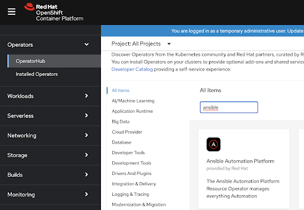

# Deployment Process

### 1- Deploy OpenShift (here are videos of how to deploy it on GCP or AWS)
For a more comprehensive deployment overview, check out this reference.

### 2- Install Ansible Automation
In the OpenShift console, login to Operator Hub and search for Ansible Automation Platform



Install the Operator by choosing the default options. Once the operator is deployed, deploy the automation controller (Under Installed Operators, find the Operator then create the automation controller - see below). You can give it any name (example “controller”).


In order to get the admin password for the UI, use the following command in the OpenShift CLI:
oc get secret controller-admin-password -o jsonpath="{.data.password}" | base64 --decode

To login to the Ansible UI, in your OpenShift dashboard, find the Ansible controller route under “Routes”, login and use the admin credentials (password from command above) to login.

### 3- Install Dynatrace
After you sign up for a Dynatrace account (dynatrace.com), you will need to retrieve your apiToken and paasToken.
Install the Dynatrace Operator from the Operator Hub (use namespace “dynatrace”)


Once you have the tokens, create a secret called “dynakube” in OCP using this command:
```
oc -n dynatrace create secret generic dynakube --from-literal="apiToken=dt0c01.Q7J5AV6ZWVXX57LWWBYUL3EQ.NWTFX7LIW2VUM55A7SKBQLAYHFIGRUB7M5E3UTDZNCRLFV36OUNAJ4IBHJCAMBE5" --from-literal="paasToken=dt0c01.PSGJATLU52VT4RC6N7JAZGRP.RVXZ3G2HBFU3VVIL4I6U6QXM22JRNJJEZ33L226RLX7KJAB44GA6ORGCTQWLIAAV"
```

Now go to the Operator UI and create a DynaKube instance using the environment URL and secret you just created.

Then go to your Dynatrace dashboard https://<envID>.live.dynatrace.com/
Go to Settings> Cloud and Virtualization -> Kubernetes -> Connect new cluster
In the form, enter your api URL and Bearer Token. Even if your cluster is airgapped/disconnected, this is still feasible (for example, URL can be https://192.168.116.107:6443). To get the bearer token, run this command:
```
oc get secret $(oc get sa dynatrace-kubernetes-monitoring -o jsonpath='{.secrets[0].name}' -n dynatrace) -o jsonpath='{.data.token}' -n dynatrace | base64 --decode
```
or
```
oc get secret $(oc get sa dynatrace-kubernetes-monitoring -o jsonpath='{.secrets[1].name}' -n dynatrace) -o jsonpath='{.data.token}' -n dynatrace | base64 --decode
```
depending on your OCP cluster.

In Dynatrace dashboard, go to Settings -> Integration-> Problem Notifications> Add a notification
Webhook URL: http://my-bridge-route-amq.apps.ocp-rony.openshiftcorpredhat.com/topics/dynatrace-prob-notify

Custom Payload:
```
{
    "records": [
        {
            "value": {
                "State": "{State}",
                "ProblemID": "{ProblemID}",
                "ProblemTitle": "{ProblemTitle}",
                "ProblemDetailsMarkdown": "{ProblemDetailsMarkdown}",
                "ProblemDetailsJSON": {ProblemDetailsJSON},
                "ProblemImpact": "{ProblemImpact}",
                "ProblemSeverity": "{ProblemSeverity}",
               "ProblemURL": "{ProblemURL}",
               "Tags": "{Tags}",
                "ImpactedEntities": {ImpactedEntities}
            }
        }
    ]
}
```
Run the following command and extract the certificate:
```
oc get kafka -o yaml 
```
    
In the Dynatrace dashboard, create a synthetic monitor using:
Monitor -> Synthetic -> Create a synthetic monitor -> Create an HTTP monitor
Name: BEER-Service-HTTP-Monitor
URL: https://beer-native-beer.apps.openshift.dfw.ocp.run/ (substitute with your URL)
Monitor every 1 minute (from location: Texas.. you can select more) 

### 4- Install middleware services and application

```
git clone https://github.com/ocp-run/selfhealinginfra
cd scripted-install
./provision.sh
```

### 5- Run the load test and verify the closed loop.
Here is a sample load test you can run (using the hey tool):
```
#!/bin/sh
for i in {1..8}
do
    requests=$((100+50*i));echo "output: iteration $i";
    ./hey -c $requests -q 1 -z 30s -m GET <app_URL>
done
#run at constant high load for 10 minutes
./hey -c 500 -q 1 -z 10m -m GET <app_URL>
```
