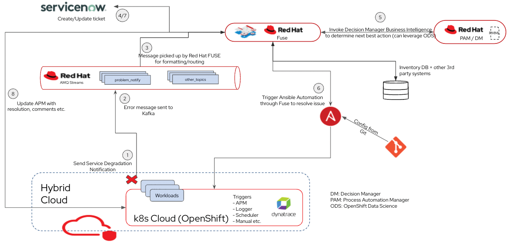

<h1>Setting up the Self Healing Demo</h1>

Table of Contents

<ul>
	<li><a href="#_background">Background</a></li>
	<li><a href="#_prerequisites">Prerequisites</a></li>
	<li><a href="#_architecture">Architecture</a></li>
	<li><a href="#_run">Running the provision.sh</a></li>
</ul>

<h2>Background</h2>

The provision.sh script install and configures the self healing demodemo.

<h2>Prerequisites</h2>

<ul>
	<li>Red Hat OpenShift Container Platform</li>
	<li>Red Hat Ansible Tower</li>
	<li>Dynatrace Account</li>
	<li>Dynatrace Configured on Red Hat OpenShift Container Platform</li>
	<li>JDK 1.8</li>
	<li>Access to Ansible API URL and API Token</li>
	<li>Dynatrace API URL and API Token</li>
	<li>Service Now URL</li>
</ul>

<h2>Architecture</h2>

As shown in Figure 1, the proposed solution assumes a workload (example: 5G core network function, RAN vCU, etc.) running on a Kubernetes-based platform like Red Hat OpenShift, in a hybrid cloud environment. The workload can consist of multiple microservices that need to be monitored.&nbsp; 
As you can see we opted to leverage Dynatrace as the observability platform to monitor our workload. Dynatrace integrates nicely with OpenShift using the Operator Framework so its deployment is simple and scalable as we will describe below. However any other monitoring or logging framework can be leveraged.

<h2>Running the provision.sh</h2>

<ol>
	<li>Directory structure
	<ul>
		<li>At the root you have the provision.sh, this is the main file for installing and configuring the demo on OpenShift Container Platform</li>
		<li>amq folder - contains scripts for installing and configuring the AMQ Cluster and setting up the topics</li>
		<li>integ-apps - contains yaml files for installing and configuring the applications for providing the integration applications</li>
		<li>beer-app - contains yaml files for setting the test application which will provide the rest endpoint for testing</li>
	</ul>

	

	</li>
	<li>Editing the provision.sh
	<ol>
		<li>Open the provision.sh in any text editor</li>
		<li>At the beginning there are a few variable for which you need to provide appropriate values
		<ul>
			<li>ANSIBLE_API_URL - Ansible Tower API URL</li>
			<li>ANSIBLE_API_TOKEN - Ansible API Token</li>
			<li>DYNA_API_URL - Dynatrace API URL</li>
			<li>DYNA_API_TOKEN - Dynatrace API Token</li>
			<li>SNOW_URL - Service Now URL</li>
		</ul>
		</li>
		<li>Next section contains the names of the various projects for AMQ, Integration Applications and the Test application replace as appropriate
		<ul>
			<li>AMQSTREAMS_PROJECT_NAME - Project Name for installing &amp; Configuring&nbsp;the AMQ Cluster</li>
			<li>AMQSTREAMS_PROJECT_DISPLAY_NAME - Project Description for the AMQ Cluster (no spaces)</li>
			<li>MIDDLEWARE_PROJECT_NAME - Project Name for installing &amp; Configuring&nbsp;the Middleware Applications</li>
			<li>MIDDLEWARE_PROJECT_DISPLAY_NAME - Project Description for the Middleware Applications</li>
			<li>APP_PROJECT_NAME - Project Name for installing &amp; Configuring&nbsp;the Test Applications</li>
			<li>APP_PROJECT_DISPLAY_NAME -&nbsp;Project Description for the Test Applications</li>
		</ul>
		</li>
		<li>Run the script ./provision.sh</li>
	</ol>

	

	

	</li>
</ol>